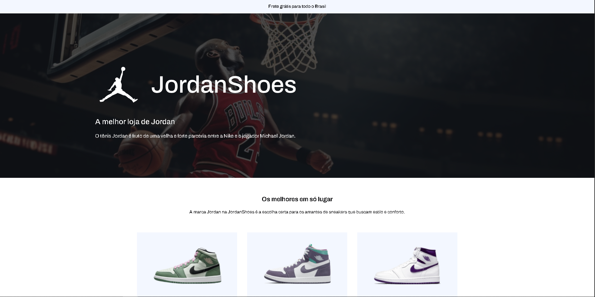

# 🏀 Jordan Shoes Store



## 📌 Sobre o projeto

Este é um projeto de **landing page para uma loja de tênis Jordan**, com foco em design moderno, responsividade e boas práticas de desenvolvimento front-end.

🚨 **Importante:**
Este projeto é **100% educacional** e foi desenvolvido como **desafio prático do curso do professor Yuri Silva**.
Todo o layout foi baseado no design disponibilizado por ele, com o objetivo de treinar habilidades em HTML, CSS e responsividade.

🔗 Curso do Yuri: https://iuricode.com
🔗 GitHub do Yuri: https://github.com/iuricode

---

## 🚀 Deploy

Você pode acessar o projeto online aqui:

👉 **[Ver projeto ao vivo](https://anaclarissi.github.io/Code_Lab-jordan-shoes/)**

---

## 💼 Minhas redes

Vamos nos conectar:

* 💻 GitHub: https://github.com/anaClarissi
* 💼 LinkedIn: https://linkedin.com/in/anaclarissi

---

## 🖼️ Preview

Confira como ficou o layout do projeto:


---

## 🛠️ Tecnologias utilizadas

Este projeto foi desenvolvido utilizando:

* **HTML5** → Estrutura semântica da página
* **CSS3** → Estilização e responsividade
* **CSS Grid** → Layout dos cards de produtos
* **Flexbox** → Organização dos elementos
* **Bootstrap 5** → Utilitários e grid system
* **Google Fonts (Archivo)** → Tipografia moderna

---

## 📱 Responsividade

O projeto foi desenvolvido com abordagem **mobile-first**, garantindo uma boa experiência em:

* 📱 Dispositivos móveis
* 💻 Tablets
* 🖥️ Desktop

---

## 📚 Aprendizados

Durante o desenvolvimento deste projeto, pratiquei:

* Estruturação semântica com HTML
* Uso combinado de **Grid + Flexbox**
* Responsividade com media queries
* Organização de layout com Bootstrap
* Boas práticas de CSS (variáveis, organização e reutilização)

---

## 📂 Estrutura do projeto

```
📁 src
 ├── 📁 assets
 │    ├── 📁 images
 │    └── 📁 ico
 ├── 📁 css
 │    └── style.css
📄 index.html
```

---

## 🎯 Objetivo

O principal objetivo deste projeto foi:

✔ Praticar construção de landing pages
✔ Melhorar habilidades em layout responsivo
✔ Trabalhar com design baseado em Figma
✔ Evoluir como desenvolvedora front-end

---

## 📌 Status

✅ Projeto finalizado

---

## ❤️ Créditos

Projeto desenvolvido com base no desafio proposto por:

👨‍💻 **Yuri Silva**
🔗 https://iuricode.com

---

## 📎 Licença

Este projeto é apenas para fins educacionais e não possui fins comerciais.
